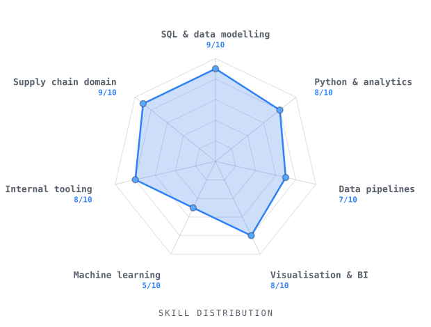

 

---

## `~/about-me`

<table>
<tr>
<td>

**a.** &nbsp;I'm a **supply chain analyst** with 4+ years in retail logistics, sitting right where operations meet engineering. I spend as much time on the warehouse floor logic as I do in the query editor.

**b.** &nbsp;I build operational tools that turn complex workflows into scalable, reliable systems - from planning and validation applications to Databricks pipelines that replace manual, spreadsheet-driven processes.

**c.** &nbsp;I'm expanding into Data Engineering and Machine Learning, building the systems and pipelines that turn raw operational data into reliable insights, forecasts, and intelligent workflows.

</td>
</tr>
</table>

---

## `~/tech-stack`

`languages & markup`

&nbsp;&nbsp;&nbsp;
&nbsp;&nbsp;&nbsp;
&nbsp;&nbsp;&nbsp;
&nbsp;&nbsp;&nbsp;
&nbsp;&nbsp;&nbsp;

 

`data & bi`

&nbsp;&nbsp;&nbsp;&nbsp;&nbsp;&nbsp;&nbsp;&nbsp;&nbsp;
&nbsp;&nbsp;&nbsp;
&nbsp;&nbsp;&nbsp;

 

`environment`

&nbsp;&nbsp;&nbsp;
&nbsp;&nbsp;&nbsp;
&nbsp;&nbsp;&nbsp;
&nbsp;&nbsp;&nbsp;
&nbsp;&nbsp;&nbsp;
&nbsp;&nbsp;&nbsp;

---

## `~/skills`

---

## `~/contributions`

  

<picture>
  <source media="(prefers-color-scheme: dark)" srcset="https://raw.githubusercontent.com/ShanedixonGit/ShanedixonGit/output/github-snake-dark.svg" />
  <source media="(prefers-color-scheme: light)" srcset="https://raw.githubusercontent.com/ShanedixonGit/ShanedixonGit/output/github-snake.svg" />
  
</picture>

---

## `~/streak`

---

## `~/projects`

---

## `~/connect`

  

